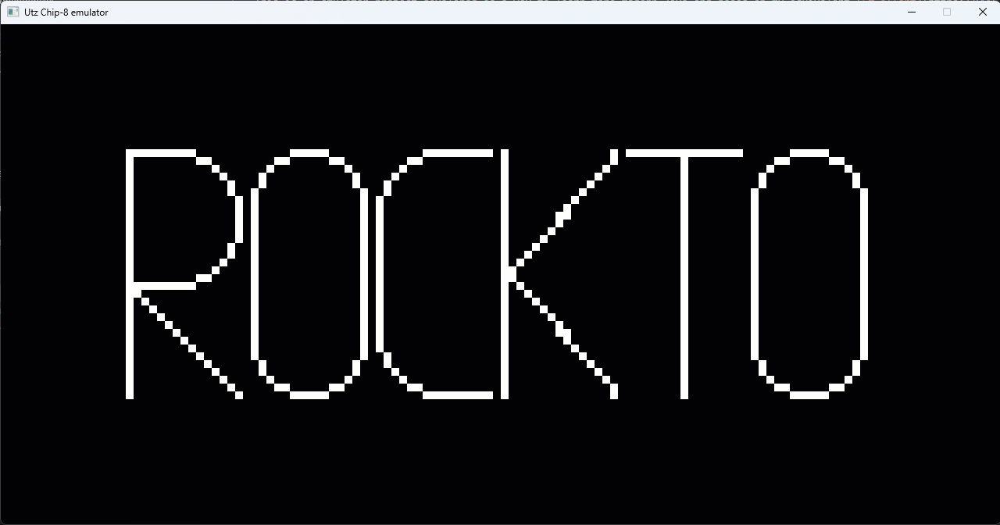

A simple [Chip-8](https://en.wikipedia.org/wiki/CHIP-8) emulator in Java. Chip-8 is an extremely early (late 1970s) specification that was meant to be implemented on DIY computers being built at the time. It primarily ran very simple games.

This is an emulator project developed as a way to learn more modern Java and based on my equivelant [C# effort](https://www.github.com/ikeras/kettle). It currently supports both the Chip-8 opcodes and the Super-Chip (schip) opcodes.

It requires Maven to build and relies on JavaFX as the graphics layer.

The following is an example of the emulator running the rockto.ch8 ROM.

